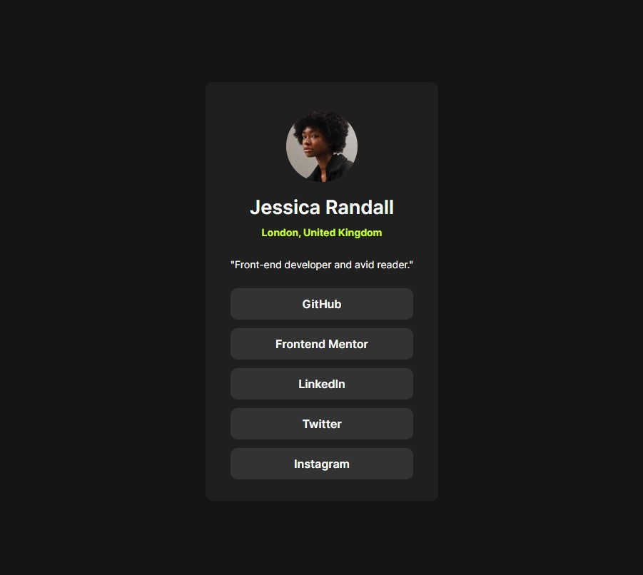

# Frontend Mentor - Social links profile solution

This is a solution to the "Social links profile challenge on Frontend Mentor" - https://www.frontendmentor.io/challenges/social-links-profile-UG32l9m6dQ).  

## Table of contents

- [Overview](#overview)
- [Screenshot](#screenshot)
- [Links](#links)
- [Built with](#built-with)
- [What I learned](#what-i-learned)
- [Continued development](#continued-development)
- [Useful resources](#useful-resources)
- [Author](#author)

## Overview

A great way to practice the basics of HTML and CSS. 

### Screenshot



### Links

- Live Solution URL: [Add live site URL here](https://your-live-site-url.com)

### Built with

- Semantic HTML5 markup
- CSS custom properties
- Flexbox

### What I learned

Wonderful recap on how to use CSS varibles: 

```css
:root {
  --primary-green: hsl(75, 94%, 57%);
  --neutral-white: hsl(0, 0%, 100%);
  --neutral-grey: hsl(0, 0%, 20%);
  --neutral-dark-grey: hsl(0, 0%, 12%);
  --neutral-off-black: hsl(0, 0%, 8%);
}
```

### Continued development

It would be great to have a small preview of each profile on hover, like the profile picture, name and maybe some specific information for each platform (like the number of contributions for GitHub, number of completed projects on Frontend Mentor, current job for LinkedIn, number of tweets for twitter and number of posts for Instagram). 


### Useful resources

- [Google Fonts] https://fonts.google.com/


## Author

- Frontend Mentor - https://www.frontendmentor.io/profile/DanielDeaconescu
